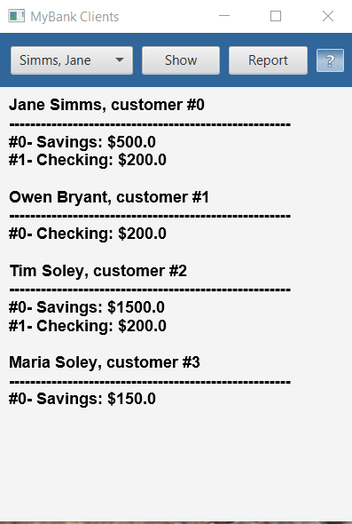

# UI Lab 5

Завдання ("п'ять"):
* Завантажте jar-файл з усіма потрібними классами (Bank, Customer, Account та ін.) з наших попередніх лаб - MyBank
* Створіть в Netbeans новий проект з назвою FxDemo (або використайте проект, створений в ході виконання попередньої роботи). УВАГА! Чекбокс Create Main Class треба очистити (не створювати виконуваний клас)!
* Додайте до проекту завантажену вами бібліотеку - правою кнопкой на проекті, обрати Properties, потім у дереві категорій обрати Libraries (другий пункт зверху), натиснути у правій частині вікна кнопку Add JAR/Folder, обрати jar-файл, завантажений у п. 1, натиснути Ok
* Додайте до проекту клас FXDemo з цього репозитрію.
* Доповніть код таким чином, щоб з файлу test.dat (робота номер 8, файл даних також є в цьому ж репозиторію) читалась інформація про клієнтів банку та їх рахунки
* Напишіть обробники подій для елементів керування, завдяки яким би при виборі клієнта та натисненні кнопки Show виводилась інформація про нього та всі його рахунки
* Додайте до форми кнопку Report, яка має виводити у нижній частині вікна звіт за клієнтами такого ж виду, як у роботі номер 8 (див. CustomerReport).
* Запустіть проект, впевніться, що все працює як очікувалось. Продемонстрируйте результат викладачеві.
## Результат

